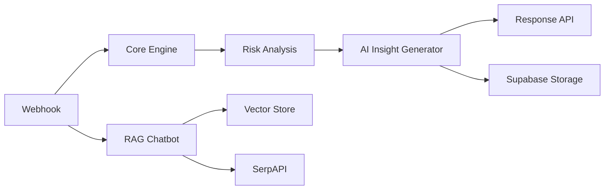

---

# 🧠 Clinical Intelligence & Health AI Workflows (n8n)

An advanced **AI-powered health intelligence system** built using **n8n**, combining:

* 🏥 Clinical RAG chatbot
* 📊 Health risk analytics engine
* 🤖 Personalized AI health assistant
* 🧬 Biological age & risk prediction

---

## 🚀 Features

### 🔹 1. Clinical Intelligence RAG Chatbot

* Uses **vector database (RAG)** for clinical guidelines
* Integrates **real-time medical research (SerpAPI)**
* Enforces strict **health-only query validation (Health Firewall)**
* Provides structured medical insights:

  * Executive Summary
  * Risk Breakdown
  * Clinical Next Steps
  * Disclaimer

---

### 🔹 2. Personalized Health AI Assistant

* Fetches user data from **Supabase**
* Maintains **conversation memory**
* Generates **context-aware responses**
* Supports real-time health Q&A

---

### 🔹 3. Advanced Health Analytics Engine

* Calculates:

  * ❤️ Heart Risk
  * 🫁 Lung Risk
  * 🧪 Metabolic Risk
  * 🧠 Mental Health Risk
  * 🍺 Liver Risk
  * 😴 Sleep Risk
* Computes:

  * 📊 Overall Health Score
  * 🧬 Biological Age
  * ⚠️ Clinical Flags

---

### 🔹 4. AI Health Insight Generator

* Generates:

  * Personalized summary
  * Future risk prediction
  * Weekly action plan
* Stores results in **Supabase**

---

## 🏗️ Architecture Overview



---

## 🔌 API Endpoints

### 1. Clinical Chatbot

```
POST /webhook/health-chat
```

**Request:**

```json
{
  "chatInput": "How to reduce heart risk?",
  "sessionId": "user-1"
}
```

---

### 2. Personalized Health Chat

```
POST /webhook/chat
```

**Request:**

```json
{
  "userId": "user_123",
  "message": "How is my health?"
}
```

---

### 3. Health Intelligence Engine

```
POST /webhook/health-intelligence
```

**Request:**

```json
{
  "age": 21,
  "weight": 70,
  "height": 175,
  "sleep": 6,
  "steps": 8000
}
```

---

## ⚙️ Tech Stack

* ⚡ n8n – Workflow orchestration
* 🧠 OpenAI – LLMs (GPT models)
* ⚡ Groq – Fast LLM inference
* 🗄️ Supabase – Database
* 🔍 SerpAPI – Medical research retrieval
* 📚 Vector Store – Clinical RAG knowledge base

---

## 🔒 Health Firewall

The system strictly:

* ✅ Accepts only **health-related queries**
* ❌ Rejects:

  * Coding questions
  * Politics
  * Entertainment
  * General trivia

---

## 🧪 Clinical Intelligence Logic

* Uses medical metrics like:

  * **FIB-4** (Liver fibrosis)
  * **METS-IR** (Insulin resistance)
  * **AHA PREVENT**
  * **PLCOm2012**

* Applies:

  * Risk scoring models
  * Threshold-based validation
  * Clinical flag detection

---

## 📦 Setup Instructions

### 1. Import Workflow

* Open n8n
* Import JSON file
  👉 

---

### 2. Configure Credentials

* OpenAI API Key
* Groq API Key
* SerpAPI Key
* Supabase Credentials

---

### 3. Setup Database (Supabase)

Create table:

```sql
user_health (
  user_id text,
  input json,
  signals json,
  risks json,
  biological_age json,
  top_risks json,
  summary text,
  future_risk text,
  actions json,
  keyvalues json
)
```

---

### 4. Activate Workflows

* Enable all workflows in n8n
* Copy webhook URLs

---

## 📊 Example Output

```json
{
  "summary": "Your current health shows moderate metabolic risk...",
  "future_risk": "If habits continue, risk of diabetes may increase...",
  "actions": [
    "Walk 10,000 steps daily",
    "Sleep 7+ hours",
    "Reduce processed food"
  ]
}
```

---

## 🎯 Use Cases

* 🏥 Digital health assistants
* 🧬 Preventive healthcare platforms
* 📱 Fitness & lifestyle apps
* 🧑‍⚕️ Clinical decision support systems
* 🏆 Hackathons (HealthTech / AI)

---

## ⚠️ Disclaimer

This system provides **AI-assisted health insights** and **NOT medical diagnosis**.
Always consult a certified medical professional.

---

## 👨‍💻 Author

Built for **high-performance AI health intelligence systems** using n8n + LLMs.

---


